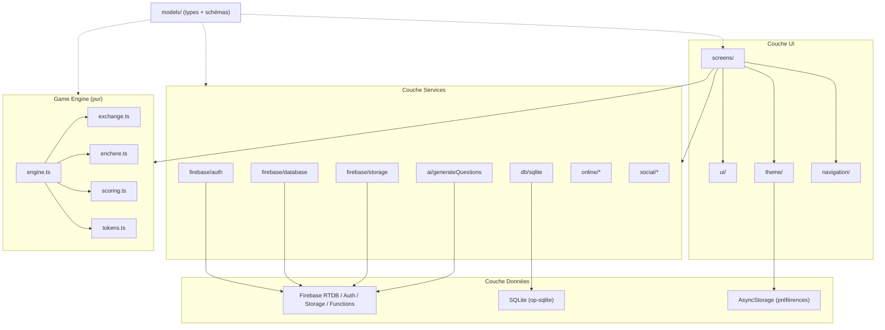

# Architecture — Le Jeu

Application React Native CLI (v0.85) de quiz stratégique. Le code source vit dans `src/`, les Cloud Functions dans `functions/src/`, et la persistance combine Firebase (en ligne) et SQLite (hors ligne).

---

## Vue d'ensemble

Le Jeu est structuré en **quatre couches** :

| Couche | Rôle | Emplacement |
|--------|------|-------------|
| **UI** | Écrans React Native, composants réutilisables, thème | `src/screens/`, `src/ui/`, `src/theme/` |
| **Services** | Auth, RTDB, stockage, IA, SQLite, matchmaking, social | `src/services/` |
| **Game Engine** | Logique pure du duel (state machine, Échange, Enchère, scoring, jetons) | `src/game/` |
| **Données** | Firebase RTDB + Auth + Storage + Functions ; SQLite local | `src/models/`, `src/services/db/`, `src/services/firebase/` |

Le point d'entrée `App.tsx` initialise SQLite, injecte le pack par défaut si la base est vide, puis monte les providers (`ThemeProvider` → `ToastProvider` → `AuthProvider` → `Bootstrap` → navigation).

---

## Diagramme des couches



---

## Flux de données principaux

### 1. Authentification

```
WelcomeScreen → AuthContext → firebase/auth
                           → firebase/database (upsert profil à l'inscription)
                           → mode démo si Firebase non configuré
```

- `AuthContext` écoute `onAuthStateChanged`.
- Si Firebase n'est pas initialisé (`env.isFirebaseConfigured() === false`), l'app démarre en **mode démo** avec un profil fictif.
- `RootNavigator` affiche `Auth` ou `Main` selon `profile || isDemoMode`.

### 2. Packs de questions

```
PackEditor / PackImport → sqlite.savePack()
Explore / Home          → sqlite.getAllPacks() + DEFAULT_PACKS (fallback)
PackImport (IA)         → ai/generateQuestions → Cloud Function generateQuestions
```

- Les packs locaux sont la source de vérité hors ligne.
- `App.tsx` seed le pack `pack-default-1` au premier lancement.

### 3. Création et lancement de partie

```
HomeScreen → MatchSetupScreen → GameLobbyScreen → DuelScreen
              (paramètres)        (lobby local)     (game engine local)
```

- En mode en ligne (Phase 2) : `online/matchmaking.createOnlineMatch()` → RTDB `matches/`.
- Le duel local utilise le moteur en mémoire (`createDuel` dans `DuelScreen`).

### 4. Déroulement d'un duel

```
DuelScreen (état React)
    ↕ setDuel(prev => handleXxx(prev, ...))
Game Engine (fonctions pures, immuables)
    → confirmStrategicChoice / handleExchange* / handleEnchere* / finishRound
```

- Aucune dépendance React dans `src/game/` : testable unitairement (`jest`).
- Le chrono est géré côté UI via `setInterval` qui décrémente `timeRemaining` et appelle les handlers de timeout.

### 5. Synchronisation en ligne (préparée)

```
RTDB paths: matches/, duels/, users/, presence/, lobby/
subscribeToMatch / subscribeToDuel → callbacks temps réel
```

Les écrans n'utilisent pas encore pleinement la synchro RTDB pour le duel ; l'infrastructure est en place dans `services/firebase/database.ts` et `services/online/`.

---

## Navigation

```
RootStack
├── Auth (stack)          → Welcome, Login, Register, ForgotPassword
└── Main (tabs)           → Home, Explore, Create, Social, Profile
    + écrans modaux/stack → MatchSetup, PackEditor, PackDetail, PackImport,
                            GameLobby, Duel, TournamentBracket, Mercato,
                            Spectator, Settings, ClubDetail, UserProfile
```

Types stricts dans `src/navigation/types.ts` (`RootStackParamList`, `AuthStackParamList`, `MainTabParamList`).

---

## Conventions de code

### Alias `@`

Configuré dans `tsconfig.json` et `babel.config.js` :

```json
"paths": { "@/*": ["src/*"] }
```

```js
alias: { '@': './src' }
```

Import type : `import { Duel } from '@/models'`, `import { Button } from '@/ui'`.

### Structure des dossiers `src/`

| Dossier | Contenu |
|---------|---------|
| `config/` | Variables d'environnement (`env.ts`) |
| `context/` | Contextes React (`AuthContext`) |
| `data/` | Données statiques intégrées (`defaultPacks`) |
| `game/` | Moteur de jeu pur TypeScript |
| `models/` | Types métier + schémas RTDB/SQLite |
| `navigation/` | Navigateurs et types de routes |
| `screens/` | Écrans par domaine (`auth`, `home`, `game`, …) |
| `services/` | Accès données et APIs externes |
| `theme/` | Tokens design + `ThemeProvider` |
| `ui/` | Composants UI réutilisables |

### Principes du game engine

- **Immutabilité** : chaque handler retourne un nouvel objet `Duel`.
- **Séparation** : `engine.ts` orchestre ; `exchange.ts` et `enchere.ts` gèrent les sous-états.
- **Pas d'effets de bord** : pas d'appels réseau, pas de `Date.now()` dans les transitions (sauf timestamps des enchères).

### Tests

- Jest avec preset React Native.
- Tests du moteur : `src/game/__tests__/`.
- Commande dédiée : `npm run test:game`.

### TypeScript

- `strict: true`, `noImplicitAny: true`.
- Le dossier `functions/` est exclu du `tsconfig` racine (projet séparé).

---

## Modes de connexion

| Mode | Description | État actuel |
|------|-------------|-------------|
| `mono_device` | Un seul appareil, arbitre intégré | Implémenté (défaut) |
| `local` | Plusieurs appareils, code de salle | Lobby avec code ; synchro partielle |
| `online` | Firebase RTDB temps réel | Infrastructure prête, UI Phase 2 |

---

## Dépendances clés

| Package | Usage |
|---------|-------|
| `@react-navigation/*` | Navigation stack + tabs |
| `@react-native-firebase/*` | Auth, RTDB, Functions, Storage |
| `@op-engineering/op-sqlite` | Base locale |
| `phosphor-react-native` | Icônes |
| `react-native-reanimated` | Animation chrono |
| `zod` | Validation schémas (Functions) |
| `uuid` | Génération d'IDs |

---

## Documents connexes

- [FILE_STRUCTURE.md](./FILE_STRUCTURE.md) — Arborescence détaillée
- [GAME_ENGINE.md](./GAME_ENGINE.md) — Moteur de jeu
- [API.md](./API.md) — Contrats API et schémas
- [SCREENS.md](./SCREENS.md) — Écrans et navigation
- [SETUP.md](./SETUP.md) — Installation et configuration
- [UI_COMPONENTS.md](./UI_COMPONENTS.md) — Composants et thème
- [design.md](./design.md) — Spécifications visuelles (non modifié)
- [cahier_des_charges.md](./cahier_des_charges.md) — Cahier des charges fonctionnel
